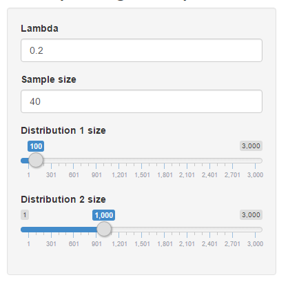
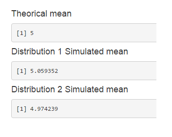
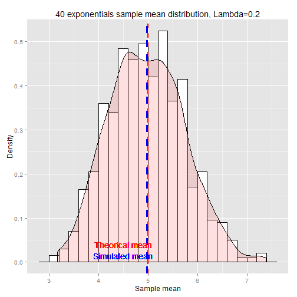

Coursera Data Science Specialization - Developing Data Products
========================================================
author: phansoks, phansoks@gmail.com
date: 21/10/2015

Presentation
========================================================

This apps simulates one of the course project done in the Statistical Inference 
class about the exponential distribution and the central limit theorem. 

The goal is to shows visually the evolution of a distribution depending on 
several parameters.

2 plots representing 2 different exponential distribution are displayed in order 
to compare differents settings.

Inputs
========================================================

***
We have 2 types of inputs. First type is shared between the two plots, meaning
that their values are the same in the computation of the distribution. Whereas, 
Second type (distribution size) is specific to one plot.

The goal is to show that with an increasing distribution size, the sample mean 
will get closer to the theorical mean.

Outputs 
========================================================
Outputs will be 2 density plots, which are automatically refreshed after any
parameters' modifications.

And the exact value of sample mean for each distribution is also computed.

***

Demo
========================================================

***
 
Link: https://phansoks.shinyapps.io/apps
